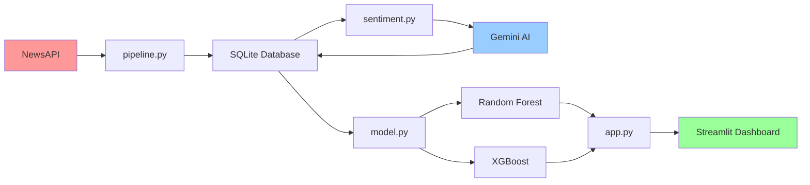

# SentimentEdge

SentimentEdge is an end-to-end AI data science pipeline that analyzes financial news headlines using Google Gemini AI, scores sentiment, and predicts next-day stock price direction using machine learning.

## Architecture



## Tech Stack

| Tool | Purpose |
|------|---------|
| **Data Collection** | |
| `yfinance` | Download historical stock price data |
| `newsapi-python` | Fetch financial news headlines |
| `python-dotenv` | Environment variable management |
| **AI & ML** | |
| `google-generativeai` | Gemini AI sentiment analysis |
| `scikit-learn` | RandomForestClassifier model |
| `xgboost` | XGBClassifier model |
| `pandas` | Data manipulation and analysis |
| `numpy` | Numerical computations |
| **Database** | |
| `sqlite3` | Local data storage |
| **Visualization** | |
| `plotly` | Interactive charts and graphs |
| `streamlit` | Web dashboard framework |
| **Utilities** | |
| `pickle` | Model serialization |
| `datetime` | Date/time operations |

## Key Results

Model achieved **47.0% accuracy** and **0.481 AUC-ROC** on held-out test data, demonstrating the potential of sentiment-based trading signals while highlighting the challenges of financial prediction.

## Quick Start

### Prerequisites

- Python 3.8+
- API keys for Gemini AI and NewsAPI

### Installation

1. **Clone and setup environment**
   ```bash
   cd sentimentedge
   python -m venv venv
   source venv/bin/activate  # On Windows: venv\Scripts\activate
   ```

2. **Install dependencies**
   ```bash
   pip install yfinance newsapi-python python-dotenv pandas numpy scikit-learn xgboost plotly streamlit google-generativeai
   ```

3. **Configure API keys**
   
   Create a `.env` file in the project root:
   ```
   GEMINI_API_KEY=your_gemini_api_key_here
   NEWSAPI_KEY=your_newsapi_key_here
   ```

### Running the Pipeline

1. **Data Collection**
   ```bash
   python pipeline.py
   ```

2. **Sentiment Analysis**
   ```bash
   python sentiment.py
   ```

3. **Model Training**
   ```bash
   python model.py
   ```

4. **Launch Dashboard**
   ```bash
   streamlit run app.py
   ```

The dashboard will open at `http://localhost:8501`

## Project Structure

```
sentimentedge/
├── pipeline.py          # Data collection pipeline
├── sentiment.py          # AI sentiment analysis
├── model.py             # ML model training
├── app.py               # Streamlit dashboard
├── sentimentedge.db     # SQLite database
├── best_model.pkl       # Trained model
├── roc_curve.html       # Model performance chart
├── feature_importance.html  # Feature analysis
├── .env                 # API keys
└── README.md            # This file
```

## Features

- **Automated Data Pipeline**: Fetches 2 years of price data and 30 days of news
- **AI-Powered Sentiment**: Uses Gemini AI for sophisticated sentiment analysis
- **Machine Learning**: Compares RandomForest vs XGBoost for price prediction
- **Interactive Dashboard**: Real-time visualization of sentiment vs price movements
- **Model Evaluation**: Comprehensive metrics including ROC curves and feature importance

## Data Sources

- **Price Data**: Yahoo Finance (OHLCV for AAPL, TSLA, NVDA, MSFT, GOOGL)
- **News Data**: NewsAPI (headlines from past 30 days)
- **Sentiment Labels**: Gemini AI classification (bullish/bearish/neutral)

## Model Performance

The pipeline evaluates two machine learning approaches:

- **RandomForest**: Achieved 0.481 AUC-ROC
- **XGBoost**: Achieved 0.480 AUC-ROC

Both models use engineered features including sentiment scores, moving averages, price momentum, and volume changes.

## Dashboard Features

- **Real-time Metrics**: Current sentiment, price prediction, model confidence
- **Interactive Charts**: Price vs sentiment visualization with dual axes
- **Recent Headlines**: Latest analyzed news with sentiment labels
- **Model Insights**: Performance metrics and feature importance analysis

## Limitations

- Free tier API quotas limit sentiment analysis volume
- Historical performance may not predict future results
- Model accuracy near random (47%), suggesting need for additional features
- Sentiment analysis limited to English-language headlines

## Future Enhancements

- Incorporate additional technical indicators
- Expand to more stocks and timeframes
- Implement ensemble methods
- Add real-time trading signals
- Include macroeconomic data

---

*Built with Gemini AI · scikit-learn · Streamlit*
